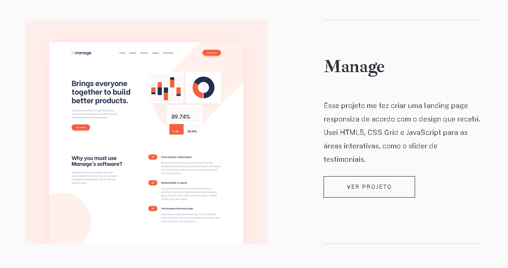
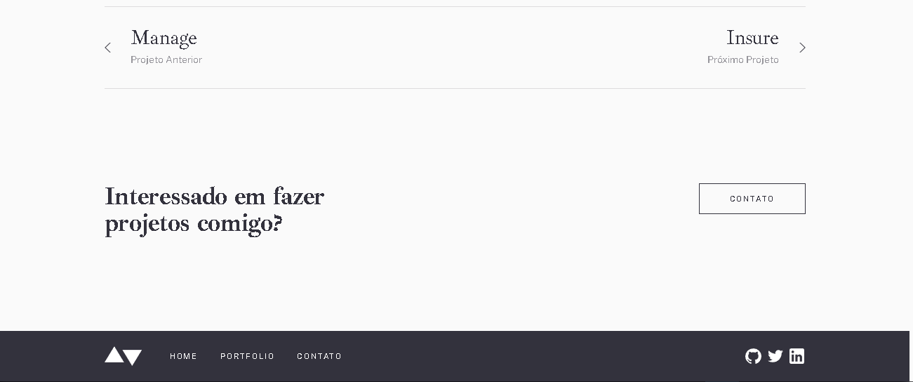

# Projeto de Portfólio

Este é um projeto de exemplo para demonstrar como criar um portfólio simples utilizando HTML e CSS com o FIGMA de base.

## Demo

[Link para a demo do projeto](https://github.com/ZynihVic/Portifolio-frontent-prjct)

## Screenshot do FIGMA 

-Desing colors

-Desing tipografia 

-Desing buttos 

-Desing Home 

## Screenshot do projeto

-Header 

-About-me 

-Projects 

-Projects-info 

-Footer 

## Funcionalidades

- Sobre mim: apresenta informações sobre o autor do portfólio 
- Lista de projetos com descrição

## Tecnologias Utilizadas

- HTML
- CSS

## Como rodar o projeto

1. Clone este repositório
2. Abra o arquivo `index.html` em um navegador

## Sobre o autor

Este projeto foi criado por [Victor Zynih](https://github.com/ZynihVic). Entre em contato para mais informações.

## Créditos 
Este projeto foi desenvolvido em aula com a empresa de ensino [Cubos Academy](https://cubos.academy/). Agradeço a todos envolvidos.

